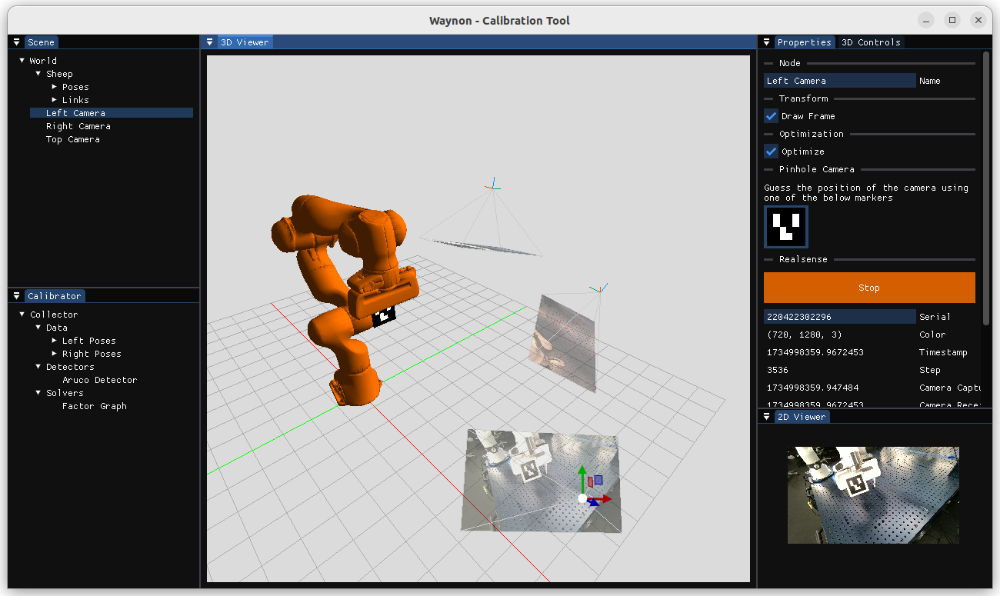
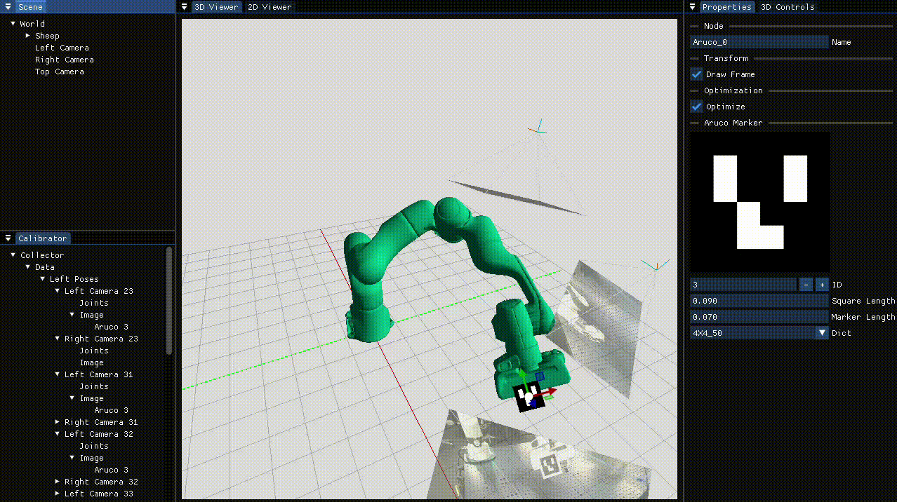
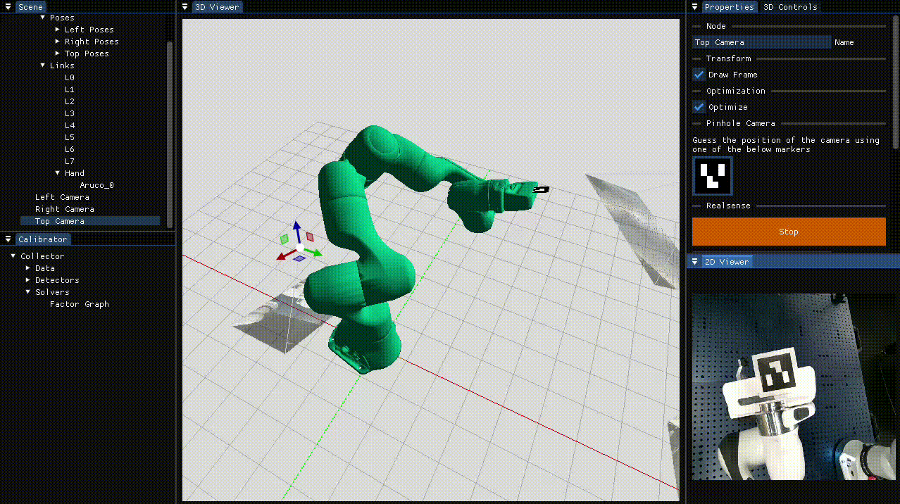
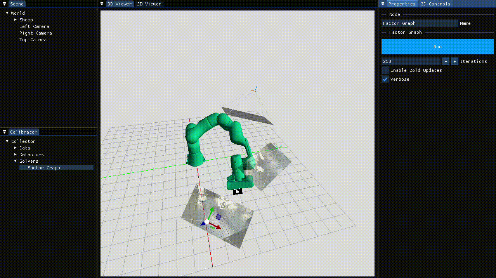

# Waynon - Calibration Tool



Waynon is a calibration tool that uses a GUI to help the user specify their problem. The user builds their scene graph by adding cameras, robots, and aruco markers. The scene graph is then used to build a factor graph that jointly optimizes the marker and camera locations. The interface allows the user to visually set rough initial poses of the elements needed to be optimized. It also allows verification and adjustment of any measurement used in the optimization (Bad marker detections can be fixed or disabled). 

## Installation
Install [pixi](https://pixi.sh/latest/#installation). Usually done like this:
```bash
curl -fsSL https://pixi.sh/install.sh | bash
```

To run:
```bash 
git clone https://github.com/bdaiinstitute/waynon
cd waynon
pixi r start
```

If you get an OpenGL error on linux, you may need to
```bash
export PYOPENGL_PLATFORM=x11
```

## Demo

Watch a [demo](https://drive.google.com/file/d/19FXmHkiccVga9ZXLLtYzjFnivqkYFcFb/view?usp=sharing) going from an empty scene to a calibrated one.

## Features
Construct your station by creating robots, cameras, and markers.



Position your marker and visually verify its the right id.


Easily get initial poses for the camera using the scene graph you built.



Correct any bad marker detections in the GUI


Set robot poses, visualize them, and the move to to them from the interface.


Solve jointly using an automatically built factor graph

o

## Disclaimer
This software is provided as a research prototype and is not production-quality software. Please note that the code may contain missing features, bugs and errors.  RAI Institute does not offer maintenance or support for this software.
